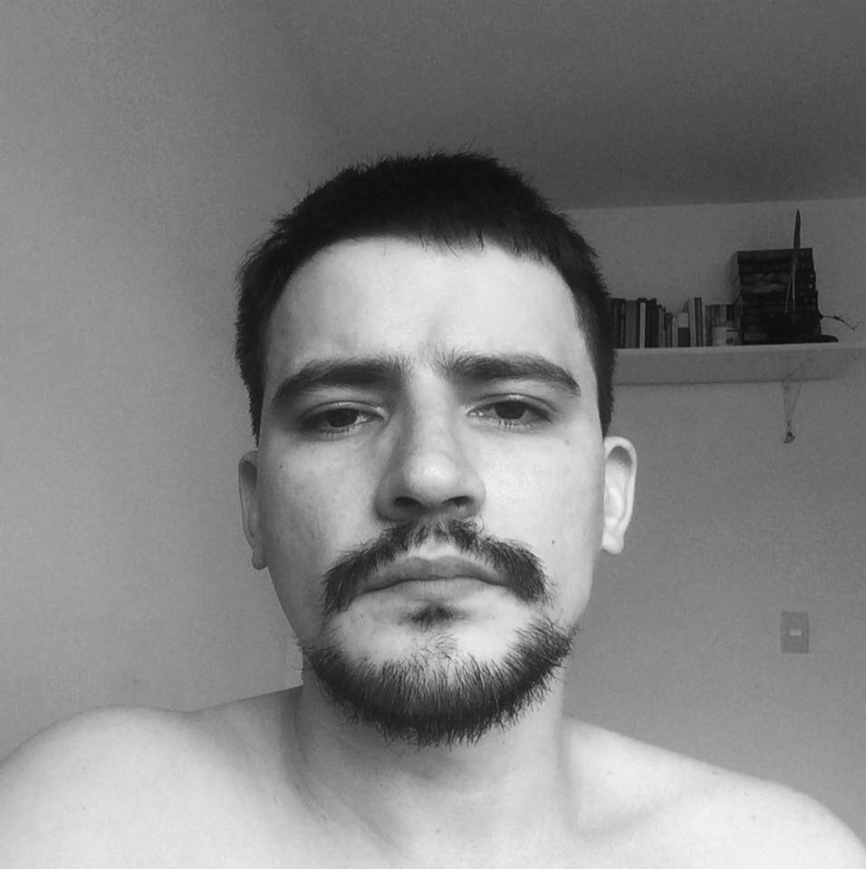

```{r echo=FALSE,  out.extra='style="float:left; padding:30px"'}

```
&nbsp;

Meu principal interesse é usar as linguagens de programação e a modelagem matemática para responder questões ecológicas.

**Formação acadêmica**

**Universidade Federal do Paraná - UFPR, Curitiba — PR **

  * 06/2015 - 09/2019 - Doutorado em Ecologia e Conservação (CAPES 6)
  * 04/2013 - 05/2015 - Mestrado em botânica (CAPES 4)
    
**Universidade do Vale do Paraíba - UNIVAP, São José dos Campos — SP **

  * 02/2009 - 01/2013 - Graduação em Ciências biológicas (Bacharelado)
    
**Instituto Federal de São Paulo - IFSP, Caraguatatuba — SP **

  * 07/2007 - 12/2008 - Técnico em gestão empresarial


